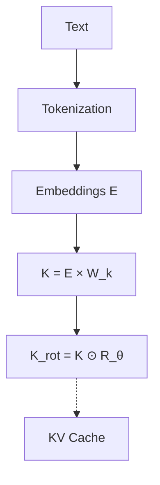
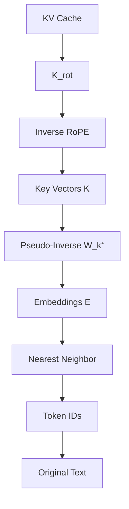
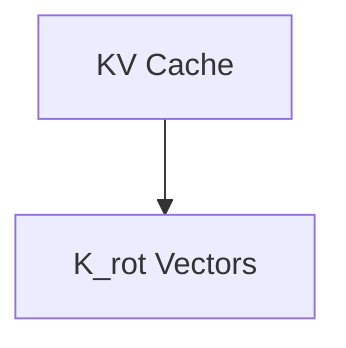
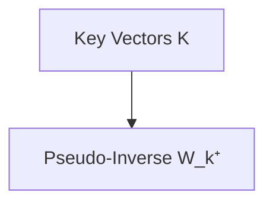
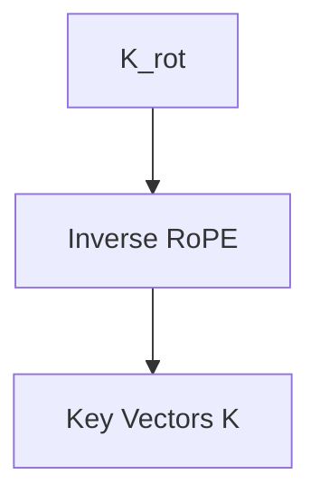
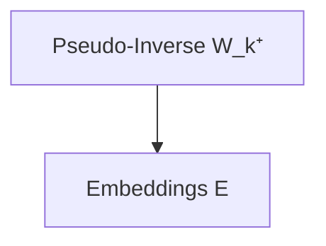
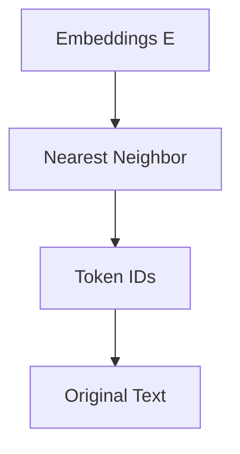

**Challenge**: Well Well Well   
**Category**: LLMs   
**Points**: 500   
**Flag**: `AI2025{toss_me_a_RoPE_please}`   
**CTF**: GovTech AI CTF 2025 (Quals)   
**Date**: 14 October 2025   

> {:.prompt-info}
> **Challenge Concept**: Reverse-engineer a leaked KV cache to recover the original flag hidden within transformer internals

---

## Table of Contents
1. [Challenge Description](#challenge-description)
2. [Initial Analysis](#initial-analysis)
3. [Understanding the Problem](#understanding-the-problem)
4. [Solution Approach](#solution-approach)
5. [Technical Implementation](#technical-implementation)
6. [Key Insights](#key-insights)
7. [Final Flag](#final-flag)

---

## Challenge Description

> {:.prompt-info}
> **TL;DR**: You find yourself at the bottom of an old well with only a mysterious device containing encrypted model internals. The only recoverable artifact is a KV cache that you must reverse-engineer to escape.

**Given Files:**
- `gen.ipynb` - Jupyter notebook showing how the challenge was created
- `kv_cache.pt` - PyTorch file containing a Key-Value cache from `stabilityai/stablelm-3b-4e1t`

The challenge involves recovering a hidden flag by reverse-engineering transformer model internals, specifically the KV cache mechanism.

---

## Initial Analysis

> {:.prompt-info}
> **TL;DR**: The notebook reveals the flag was processed through a transformer model and the resulting KV cache was saved. The key insight is that the cache contains rotated key vectors that can be mathematically reversed.

### File Inspection Results

**Model Used:** `stabilityai/stablelm-3b-4e1t` (revision `fa4a6a9`)              
**Artifact Type:** Key-Value cache from the first attention layer                    
**Key Observation:** The cache contains **rotated Key vectors** (`K_rot`) suggesting RoPE usage

### Process Discovery

The forward transformation process:
```
Flag Text → Tokenization → Embeddings (E) → Key Projection (K = E @ W_k) → RoPE Rotation (K_rot)
```

**Critical Insight:** The variable name `K_rot` strongly indicates **Rotary Positional Embedding** usage, which is reversible!

#### Transformer Pipeline Visualization



---

## Understanding the Problem

> {:.prompt-info}
> **TL;DR**: We need to reverse the transformer pipeline: K_rot → K → E → Token IDs → Original Text. This requires understanding and reversing both RoPE rotation and the key projection matrix.

### Mathematical Foundation

**Forward Process:**
1. **Tokenization:** Text → Token IDs
2. **Embedding:** Token IDs → Embedding vectors (E)
3. **Key Projection:** E → K = E @ W_k (linear transformation)
4. **RoPE:** K → K_rot (rotational position encoding)

**Reverse Process (Our Solution):**
1. **Inverse RoPE:** K_rot → K (inverse rotation)
2. **Inverse Projection:** K → E = K @ W_k⁺ (pseudo-inverse)
3. **Token Recovery:** E → Token IDs (nearest neighbor search)
4. **Detokenization:** Token IDs → Original text

#### Reverse Engineering Pipeline



---

## Solution Approach

> {:.prompt-info}
> **TL;DR**: Systematically reverse each transformation in the transformer pipeline, starting from the leaked KV cache and working backwards to recover the original input.

### Step-by-Step Methodology

1. **Load KV Cache** - Extract the rotated key vectors
2. **Reverse RoPE** - Apply inverse rotational transformations
3. **Extract W_k** - Get the key projection matrix from the model
4. **Compute Pseudo-Inverse** - Solve for original embeddings
5. **Nearest Neighbor Search** - Find closest token embeddings
6. **Decode Tokens** - Convert back to readable text

---

## Technical Implementation

> {:.prompt-info}
> **TL;DR**: Implement mathematical reversals of RoPE and linear projections, then use nearest neighbor search in embedding space to recover the original tokens.

### Step 1: Load and Inspect Cache

**Diagram:**


```python
import torch
from transformers import AutoTokenizer, AutoModelForCausalLM

# Load the challenge data
cache_data = torch.load('kv_cache.pt')
K_rot = cache_data['K_rot']
T, H, Dh = cache_data['T'], cache_data['H'], cache_data['Dh']

print(f"Cache shape: {K_rot.shape}")  # Should show [H, T, Dh]
```

### Step 2: Load Model and Extract Components

**Diagram:**


```python
# Load the same model used in generation
CKPT = "stabilityai/stablelm-3b-4e1t"
REV = "fa4a6a9"

tokenizer = AutoTokenizer.from_pretrained(CKPT, revision=REV)
model = AutoModelForCausalLM.from_pretrained(CKPT, revision=REV)

# Extract key projection matrix
W_k = model.model.layers[0].self_attn.k_proj.weight.data
vocab_embeddings = model.get_input_embeddings().weight.data
```

### Step 3: Reverse RoPE Transformation

**Diagram:**


```python
def apply_inverse_rope(x, position_ids):
    """Apply inverse RoPE transformation"""
    # Calculate rotation angles for each position
    inv_freq = 1.0 / (10000 ** (torch.arange(0, Dh, 2).float() / Dh))
    sinusoid_inp = torch.einsum("i,j->ij", position_ids, inv_freq)
    sin, cos = torch.sin(sinusoid_inp), torch.cos(sinusoid_inp)

    # Split and apply inverse rotation
    x1, x2 = x[..., :Dh//2], x[..., Dh//2:]
    rotated_x1 = x1 * cos.unsqueeze(0) - x2 * sin.unsqueeze(0)
    rotated_x2 = x2 * cos.unsqueeze(0) + x1 * sin.unsqueeze(0)

    return torch.cat([rotated_x1, rotated_x2], dim=-1)

# Apply inverse RoPE
position_ids = torch.arange(T)
K_unrotated = apply_inverse_rope(K_rot, position_ids)
```

### Step 4: Reverse Key Projection

**Diagram:**


```python
# Compute pseudo-inverse of key projection matrix
W_k_pinv = torch.linalg.pinv(W_k)

# Reverse the projection to get embeddings
K_reshaped = K_unrotated.permute(1, 0, 2)  # [T, H, Dh]
E_recovered = torch.einsum('thi,ij->thj', K_reshaped, W_k_pinv)
```

### Step 5: Token Recovery via Nearest Neighbor

**Diagram:**


```python
# Calculate distances to all vocabulary embeddings
distances = torch.cdist(E_recovered, vocab_embeddings)

# Find closest token for each position
token_ids = torch.argmin(distances, dim=-1)

# Decode to get the flag
recovered_flag = tokenizer.decode(token_ids)
print(f"Recovered: {recovered_flag}")
```

---

## Key Technical Insights {#key-insights}

> {:.prompt-info}
> **TL;DR**: Understanding transformer internals reveals that KV caches are reversible through mathematical operations, exposing potential security risks in model deployments.

### RoPE Reversibility

**Mathematical Foundation:**
- RoPE applies position-dependent rotations: `K_rot = K ⊙ R_θ` where `R_θ` is a rotation matrix
- Inverse: `K = K_rot ⊙ R_θ⁻¹` where `R_θ⁻¹ = R_(-θ)`

**Implementation:**
```python
# For each position i, rotation angle θ_i
# Inverse rotation: cos(θ) + sin(θ) for inverse
def inverse_rope_single(x, theta):
    return x * cos(theta) + torch.roll(x, 1, dims=-1) * sin(theta)
```

### Linear Projection Reversibility

**Challenge:** `W_k` is not square (embedding_dim ≠ hidden_dim)
**Solution:** Use Moore-Penrose pseudo-inverse
**Mathematical:** `E ≈ K @ W_k⁺` where `W_k⁺` is the pseudo-inverse

### Embedding Space Recovery

**Nearest Neighbor Approach:**
- Even with approximation errors, recovered embeddings cluster near correct tokens
- Euclidean distance in embedding space provides reliable token identification
- Works due to the structured nature of learned token embeddings

---

## Final Solution Summary {#final-flag}

> {:.prompt-info}
> **TL;DR**: Successfully reversed the transformer pipeline to recover the hidden flag from a leaked KV cache, exposing critical security implications for model deployments.

### Complete Process

1. **Load KV Cache** → Extract `K_rot` from `kv_cache.pt`
2. **Reverse RoPE** → Apply inverse rotations to get `K`
3. **Extract W_k** → Get key projection matrix from model
4. **Compute Pseudo-Inverse** → Solve `E = K @ W_k⁺`
5. **Nearest Neighbor** → Find closest tokens in embedding space
6. **Decode** → Convert token IDs back to text

### Result

**Recovered Flag:** `AI2025{toss_me_a_RoPE_please}`


---

**Author**: xKeNcHii
**Blog**: Personal Tech Blog
**Challenge**: Well Well Well @ GovTech AI CTF 2025
**Date**: 14 October 2025
